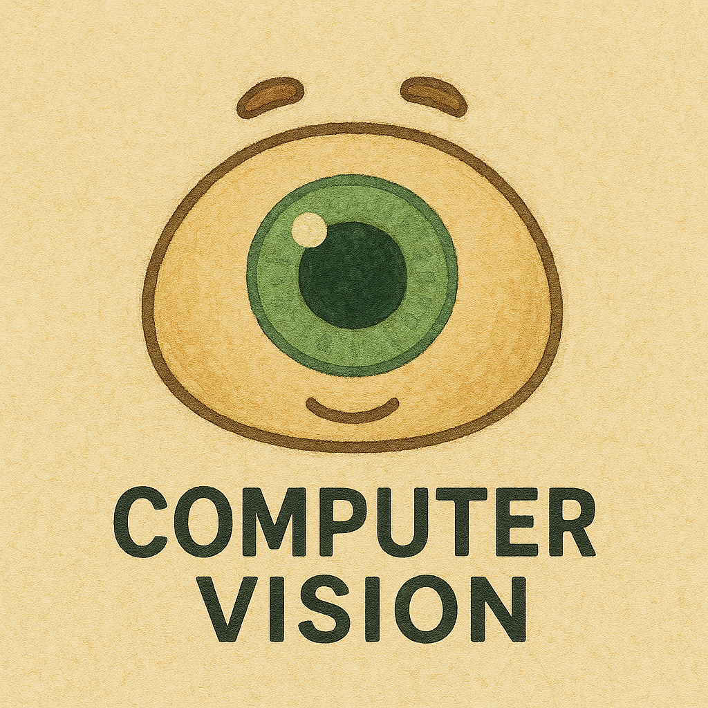

# 42LABS CV팀 Object Detection - `ft_objdet`💡



# 설치 방법 (install)

```bash
git clone https://github.com/42AILABS/ft_object_detection.git
cd team_cv_object_detection
pip install -r requirements.txt
```
  
  
# 구현 목록 리스트 (model zoo)
| 모델 (Model) | 논문 (Paper) | 타입 (Type) | 진행상황 (Progress) |
|:-------|:---|:---|:---:|
|`YOLO v1`| `You Only Look Once: Unified, Real-Time Object Detection (2015)` | `One Stage` | **O** |
|`SSD`| `SSD: Single Shot MultiBox Detector` | `One Stage` | **O** |
|| |  |  |